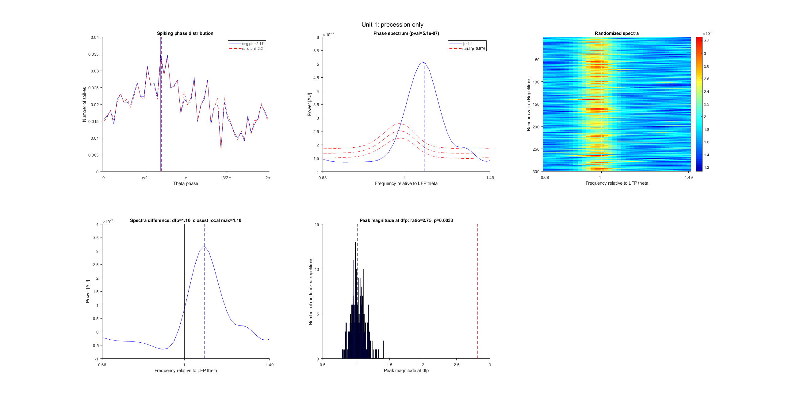

## **PhasePrecession**

This repository contains MATLAB routines used to calculate temporal phase precession by the spike phase spectrum method, described in Sloin et al., 2023, bioRxiv.
## **Overview**
The spike phase temporal precession algorithm described by Sloin et al. (2023) is designed to detect and quantify temporal phase precession of spikes. The approach minizes (1) false detections, created by phase locking; and (2) misses (false negatives) created by units that exhibit both phase locking and phase precession. The core algorithm is implemented by the MATLAB routine **spk\_phs\_spec.m**.

All the sub-routines necessary for spk\_phs\_spec.m are included in the **Analysis** and **Utilities** folders. In addition, the MATLAB deep learning toolbox is necessary for running the routines. Finally, a demo, **spk\_phs\_spec\_demo.m**, is available. 
## **Code**
### **Analysis**
- calc\_cycle.m
  - generates a vector of theta cycle from a theta phase vector
- RandCyclePhs.m
  - randomize the phase of spikes 
- spike\_spectra.m
  - calculates the spectrum of spike phases
- spk\_phs\_spec.m
  - computes spike phase spectrum and indicates the occurrence of temporal precession
### **Utilities**
- inranges
  - determine which elements of a vector are in which range
- mixmat
  - mix matrix elements
- my\_spectrum
  - Welch spectrum for multiple signals. 
- myjet
  - modified jet with extreme values in pure R,B
- ParseArgPairs
  - flexible argument assigning
- resampleranges
  - resample ranges from one Fs to another, while keeping the total duration fixed
- resort
  - indices to recover original order
- sortranges
  - to be a set of non-overlapping [ small large ] pairs

## **Data**
The sample data are used to demonstrate the calculation of spike phase spectra and deriving quatification and statistical significance. The data include spike trains and theta phases corresponding to three well-isolated pyramidal cells recorded from hippocampal region CA1 of freely-moving mice. The same examples are described in Sloin et al., 2023, bioRxiv, Fig. S2. One example unit exhibits phase precession (1\_precession\_only.mat; Fig. S2A), a second unit exhibits phase locking (2\_lock only.mat; Fig. S2B), and a third exhibits both phase locking and phase precession (3\_precession\_lock.mat; Fig. S2C). 

In all cases, the *.mat file contains three variables, all sampled at 1250 Hz:
  - spk: Spike times
  - phs: LFP theta theta phases in radians
  - periods: Start and end time of every crossing of the unit’s place field

  ## **Demo** 
The routine spk\_phs\_spec\_demo.m demonstrates the calculation of spike phase spectra by using data from three example units recorded from hippocampal region CA1 of freely-moving mice. One example unit exhibits phase locking, a second unit exhibits phase precession, and a third exhibits both phase locking and phase precession. The same examples are described in Sloin et al., 2023, bioRxiv, Fig. S2.

To demonstrate the algorithm for spike phase temporal precession, run spk\_phs\_spec\_demo.m. To run spk\_phs\_spec\_demo.m, you will need the following: 
### To run the demo
- Download all routines from this repository
- Download the data from zenodo
- In MATLAB, write spk\_phs\_spec\_demo

### Demo results
### Precession only

### Phase locking only

### Phase locking and precession 

